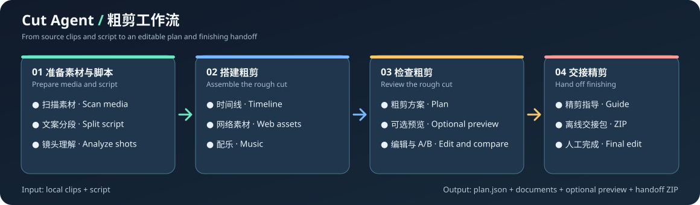

# Cut Agent

[English](README.md) · [中文使用说明](docs/usage.zh-CN.md) · [功能规划](feature.json) · [English user guide](docs/usage.md)

Cut Agent 把**视频或图片素材文件夹 + 文案**整理成可编辑的粗剪方案。你可以在本地 Web 工作台核对镜头、调整时间线、比较 A/B 版本、按需生成带段号的预览，并导出给精剪人员使用的交接包。



> Cut Agent 负责规划粗剪。它不会直接产出完成调色、字幕和混音的成片；可选预览用于检查节奏与结构。

## 主要能力

- 扫描本地视频与图片，识别镜头并抽取代表帧。
- 拆分文案、生成时间线，保存可编辑的 `plan.json` 和可阅读的粗剪文档。
- 在来源可用时检索补充画面与配乐；失败时记录待人工处理项。
- 在本地 Web 工作台编辑时间线、生成 A/B 版本、暂停和恢复任务。
- 手动选择相邻视频，让 LLM 结合全文、前后旁白与配乐节奏规划 1～6 个动态画面，再编写多个离线 HTML/CSS/JS 页面并合成最高 4K 的过场；支持持续配乐或单独过场音乐的拍点对齐。
- 导出精剪指导与可离线阅读的交接 ZIP。原始拍摄素材、下载的媒体源文件需要另行交给剪辑人员。
- 可由 Codex、Claude Code 等编码代理读取素材上下文并提交粗剪决策，无需另配模型 API。

## 快速开始

**环境要求：** Linux 或 Windows、Python 3.10–3.14，以及已加入 `PATH` 的 FFmpeg 和 FFprobe 5+。正式 Python 发行物已包含 Web 界面；只有前端开发需要 Node.js 与 Corepack。建议配置 OpenAI 兼容的聊天模型接口；没有模型时会使用规则降级，并在任务中标明。Chrome 与可选搜索守护进程可改善网络素材检索。

```bash
git clone https://github.com/DRAFT12138/Cut_Agent.git
cd Cut_Agent
uv sync
uv run playwright install chromium
uv run python make_sample.py
uv run cut-agent serve --port 8090
```

打开 **http://127.0.0.1:8090**，点「新建粗剪任务」，素材目录填 `sample_media` 的**绝对路径**，文案粘贴 `sample_copy.txt` 的内容。Web 任务运行期间保持服务进程开启。也可以只用命令行：

```bash
uv run cut-agent run --media sample_media --copy sample_copy.txt --seed 7
uv run cut-agent list
```

不使用 uv 时，运行 `python -m pip install .`，再通过 `python -m cut_agent.cli ...` 调用。Python 发行物已包含 Web 界面；本仓库不附带模型、FFmpeg 或生成的媒体文件。

### 使用 Codex / Claude Code 代替模型 API

先导出素材上下文，让编码代理查看其中列出的代表帧并生成 decisions JSON，再执行粗剪：

```bash
uv run cut-agent agent-context --media sample_media --copy sample_copy.txt --output agent-context.json
uv run cut-agent run --media sample_media --copy sample_copy.txt \
  --agent-decisions agent-decisions.json --no-finishing-llm --preview
```

完整代理流程与 JSON 契约见 [`cut-agent-rough-cut` Skill](skills/cut-agent-rough-cut/SKILL.md)。
新版契约允许代理按节奏为同一旁白段安排多个镜头，同时要求提交可审阅的决策轨迹；运行会把原始提案和轨迹保存到 `output/runs/<run-id>/agent/`，并把轨迹同步写入事件流，便于实时观察和事后复盘。
可将该目录复制到 Codex 的 `${CODEX_HOME:-~/.codex}/skills/`，或交给其他支持 `SKILL.md` 的编码代理加载；即使不安装 Skill，也能直接使用上述 CLI 文件协议。

## 模型与可选服务

启动前设置以下环境变量。默认模型地址是本机 OpenAI 兼容服务 `http://127.0.0.1:8088/v1`。

| 变量 | 用途 |
| --- | --- |
| `CUT_AGENT_LLM_BASE_URL` | 包含 `/v1` 的模型接口基础地址。 |
| `CUT_AGENT_LLM_MODEL` | 该接口接受的模型 ID。 |
| `CUT_AGENT_LLM_API_KEY` | API Key；默认值只是本地占位符。 |
| `CUT_AGENT_VISION=0` | 关闭多模态视频画面描述。 |
| `CUT_AGENT_CHROME` | Chrome 可执行文件路径，供浏览器检索使用。 |
| `CUT_AGENT_OWS_BASE_URL` | 可选 open-webSearch 守护进程地址，默认 `http://127.0.0.1:3210`。 |

要获得更好的镜头描述，模型接口需要支持图片输入。网络检索与配乐依赖外部网站，交付前请核对结果和素材使用权。完整操作、命令、产物与故障排查见[中文使用说明](docs/usage.zh-CN.md)。

## 开发与许可

```bash
uv run pytest -q
cd web
corepack pnpm test
corepack pnpm build
```

欢迎通过 Issue 和 Pull Request 反馈问题或贡献代码；提交缺陷时请附复现步骤，并运行相关检查。主项目采用 [MIT 许可证](LICENSE)。仓库内的 `tools/open-webSearch` 是独立的 [Apache-2.0 项目](tools/open-webSearch/LICENSE)，见[第三方说明](THIRD_PARTY_NOTICES.md)。
